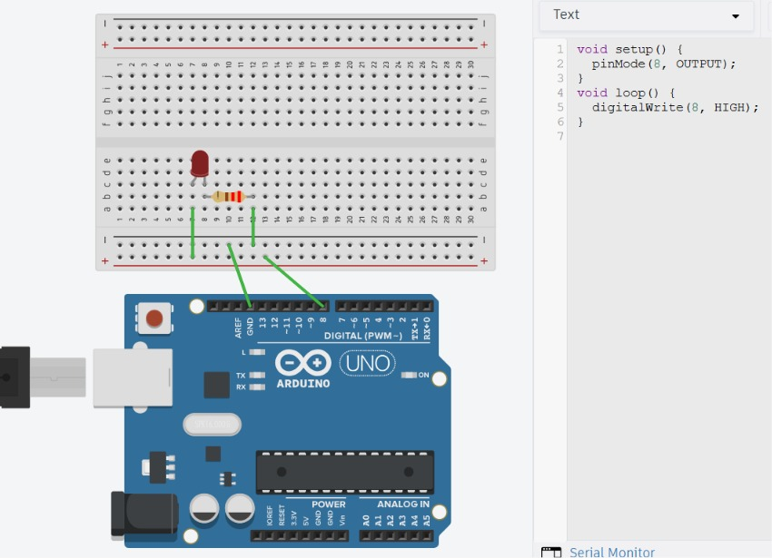

# RWS-ELE-001 — First Light

## Objective

Build the first electronic circuit using an Arduino UNO to understand how software controls a real electronic component.

The objective is not simply to turn on an LED, but to understand every component in the circuit and the purpose of each electrical connection.

---

## Components Used

- Arduino UNO
- Breadboard
- Red LED
- 220Ω Resistor
- Male-to-Male Jumper Wires
- USB Cable

---

## Theory Covered

- GPIO Output Pins
- LED Polarity
- Breadboard Internal Connections
- Current Path
- Electric Field
- Voltage
- Series Circuit

*(Full theory: see [`01-Fundamentals.md`](../../01-Fundamentals.md))*

---

## Circuit Connections

| Arduino | Component |
|---|---|
| Digital Pin 8 | Resistor |
| Resistor | LED Anode (long leg) |
| LED Cathode (short leg) | GND |



---

## Working Principle

When the program sets Digital Pin 8 to HIGH, the Arduino outputs approximately 5V. This creates a potential difference between Pin 8 and GND.

Current flows through:

```
Pin 8 → Resistor → LED → GND
```

The resistor limits the current to protect the LED. The LED emits light as current flows from the anode to the cathode.

---

## Program Logic

1. Configure Pin 8 as `OUTPUT`.
2. Continuously set Pin 8 `HIGH`.
3. The LED remains ON.

Code: [`code/First-Light.ino`](code/first-light/first-light.ino)

---

## Output

The LED remains continuously ON while the Arduino is powered.

---

## Learning Outcomes

- Built the first hardware circuit.
- Learned the importance of LED polarity.
- Understood that resistors are non-polarized (direction doesn't matter).
- Learned how breadboard internal connections (rows/columns) work.
- Understood how Arduino controls hardware using GPIO pins.
- Learned systematic hardware debugging.

---

## Common Mistakes

- Connecting the LED in reverse.
- Placing both LED legs in the same breadboard row.
- Forgetting the resistor.
- Incorrect breadboard row selection.
- Connecting GND to the wrong column.

---

## Future Improvements

- Blink the LED.
- Control blinking frequency.
- Use multiple LEDs.
- Build a traffic light simulation.