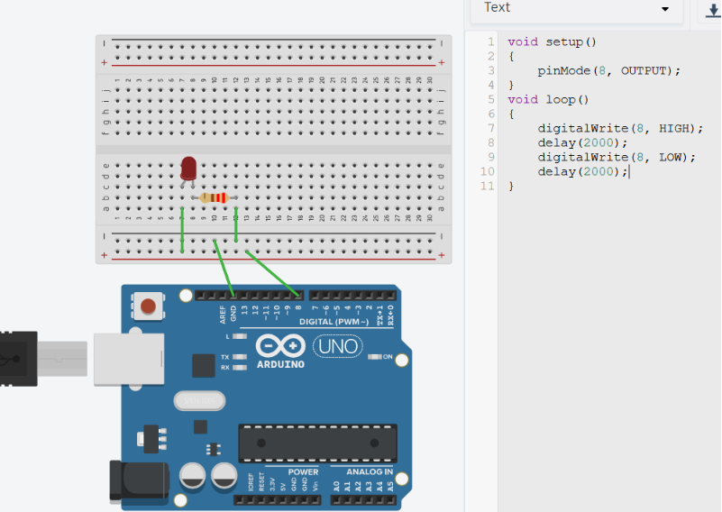

# RWS-ELE-002 — Blink

## Objective

Learn how a microcontroller executes programs continuously by blinking an LED at fixed intervals using the Arduino UNO.

---

## Components Used

- Arduino UNO
- Breadboard
- LED
- 220Ω Resistor
- Male-to-Male Jumper Wires
- USB Cable

---

## Theory Covered

- `setup()`
- `loop()`
- `digitalWrite()`
- `delay()`
- Program Execution Flow
- GPIO Output
- Timing
- Blocking Delay
- LED State Control

*(Full theory: see [`01-Fundamentals.md`](../../01-Fundamentals.md))*

---

## Circuit Connections

| Arduino | Component |
|---|---|
| D8 | LED Anode (through 220Ω resistor) |
| GND | LED Cathode |



---

## Working Principle

When the Arduino starts, the `setup()` function executes once to configure Pin 8 as an output.

After initialization, the `loop()` function executes continuously:

- The LED is turned ON using `digitalWrite(HIGH)` and remains ON for two seconds via `delay(2000)`.
- The LED is then turned OFF using `digitalWrite(LOW)` and remains OFF for two seconds.

This sequence repeats indefinitely, producing a blinking LED.

---

## Program Logic

```
Start
  ↓
Configure Pin 8 as OUTPUT
  ↓
Turn LED ON
  ↓
Wait 2 seconds
  ↓
Turn LED OFF
  ↓
Wait 2 seconds
  ↓
Repeat Forever
```

Code: [`code/Blink.ino`](code/RWS-ELE-002-Blink/RWS-ELE-002-Blink.ino)

---

## Output

The LED blinks continuously with:

- ON Time: 2 seconds
- OFF Time: 2 seconds

---

## Learning Outcomes

- Understood the purpose of `setup()` (runs once) vs `loop()` (runs repeatedly).
- Learned how `delay()` controls timing.
- Understood LED state control using HIGH and LOW.
- Realized that `delay()` is **blocking** — the Arduino cannot do anything else while waiting.

---

## Common Mistakes

- Forgetting to configure the pin as OUTPUT.
- Reversing LED polarity.
- Omitting the current-limiting resistor.
- Using `while(true)` inside `loop()` unnecessarily (loop already repeats forever).
- Assuming `delay()` allows the rest of the program to continue executing in the background.

---

## Future Improvements

- Blink at different frequencies.
- Blink multiple LEDs independently.
- Replace `delay()` with `millis()` for non-blocking timing.
- Create non-blocking LED patterns (e.g. multiple LEDs blinking at different rates simultaneously).