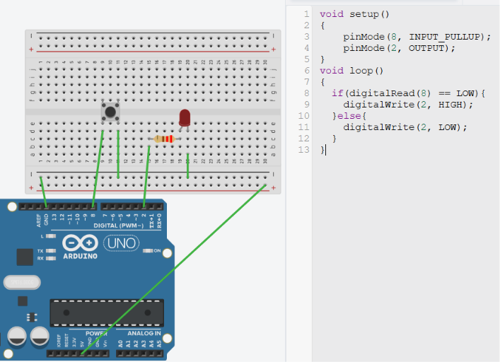

# RWS-ELE-003 — Push Button Input

## Objective

Learn how a microcontroller receives digital input from the real world and makes decisions based on that input, using a push button and an LED.

---

## Components Used

- Arduino UNO
- Breadboard
- Push Button
- LED
- 220Ω Resistor
- Jumper Wires
- USB Cable

---

## Theory Covered

- Digital Input
- Input Pin
- Push Button
- `INPUT_PULLUP`
- `digitalRead()`
- `if` Statement
- Software Decision Making
- Sense → Decide → Act

*(Full theory: see [`01-Fundamentals.md`](../../01-Fundamentals.md))*

---

## Circuit Connections

### LED

| Arduino | Component |
|---|---|
| D2 | 220Ω Resistor |
| Resistor | LED Anode |
| LED Cathode | GND |

### Push Button

| Arduino | Component |
|---|---|
| D8 | Push Button |
| Push Button | GND |

The Arduino's internal pull-up resistor is enabled using `INPUT_PULLUP`, so no external pull-up resistor is required.



---

## Working Principle

The push button is connected between the Arduino input pin and Ground.

The Arduino enables its internal pull-up resistor, keeping the input HIGH when the button is released. When the button is pressed, the input pin becomes connected to Ground and reads LOW.

The program continuously checks the button state using `digitalRead()`:

- If the button is pressed → the Arduino turns the LED ON.
- If the button is released → the LED turns OFF.

---

## Program Logic

```
Start
  ↓
Configure LED pin as OUTPUT
  ↓
Configure Button pin as INPUT_PULLUP
  ↓
Read Button State
  ↓
Button Pressed?
  ├── Yes → Turn LED ON
  └── No  → Turn LED OFF
  ↓
Repeat Forever
```

Code: [`code/Push-Button-Input.ino`](code/RWS-ELE-003-Push-Button-Input/RWS-ELE-003-Push-Button-Input.ino)

---

## Output

- Button Released → LED OFF
- Button Pressed → LED ON

---

## Learning Outcomes

- Understood digital input and how `digitalRead()` works.
- Learned why floating inputs are unreliable, and the purpose of pull-up resistors.
- Used the Arduino's internal pull-up resistor instead of an external one.
- Implemented software decision making using `if`.
- Built the first interactive embedded system — the Sense → Decide → Act loop.

---

## Common Mistakes

- Incorrect push button orientation.
- Forgetting `INPUT_PULLUP`.
- Assuming HIGH always means the button is pressed (with `INPUT_PULLUP`, it's the opposite — LOW means pressed).
- Leaving an input pin floating.
- Connecting the LED physically through the push button instead of controlling it through software.

---

## Future Improvements

- Toggle LED on each button press (instead of just following button state).
- Add software debouncing.
- Interface multiple buttons.
- Control multiple outputs using button input.