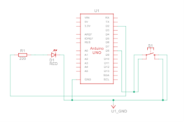

# RWS-ELE-004 — LED Toggle Using Push Button

## Objective

Build a toggle behavior instead of a follow behavior: pressing the button once turns the LED ON and keeps it ON — even after releasing — until the button is pressed again, which turns it OFF and keeps it OFF.

This is different from RWS-ELE-003, where the LED only stayed ON *while* the button was held. Achieving a toggle requires the program to detect the *moment* of a press (an event), not just the current state of the pin.

---

## Components Used

- Arduino UNO
- Breadboard
- Push Button
- LED
- 220Ω Resistor
- Jumper Wires
- USB Cable

---

## Theory Covered

- Contact Bounce and Why One Press Can Register as Multiple
- Why Debouncing Matters in Real Products
- Hardware vs Software Debouncing (concept)
- Conditional Statements — `if` / `else if` / `else`
- State vs Event
- Edge Detection (Falling Edge) in Code
- Boolean Toggle Logic (`!`)

*(Full theory: see [`01-Fundamentals.md`](../../01-Fundamentals.md))*

---

## Circuit Connections

### LED

| Arduino | Component |
|---|---|
| D2 | 220Ω Resistor |
| Resistor | LED Anode |
| LED Cathode | GND |

### Push Button

| Arduino | Component |
|---|---|
| D8 | Push Button |
| Push Button | GND |

The Arduino's internal pull-up resistor is enabled using `INPUT_PULLUP`, so no external pull-up resistor is required.

---

## Working Principle

The button pin uses `INPUT_PULLUP`, so it reads HIGH when released and LOW when pressed.

The program keeps two pieces of memory across loop iterations: `previousButtonState` and `ledState`. On every loop, it reads the current button state and compares it to the previous one. Only on the exact loop where the state changes from HIGH → LOW (the moment of pressing) does it flip `ledState` using the `!` operator and write it to the LED pin. `previousButtonState` is then updated to the current reading, so the same press is never detected twice.

Because the LED state only changes on a detected press-event (not on the button's current level), the LED stays wherever it was last set, regardless of whether the button is currently held or released.

---

## Program Logic
'''
Start
↓
Configure Button pin as INPUT_PULLUP
↓
Configure LED pin as OUTPUT, write initial ledState (LOW)
↓
Read currentButtonState
↓
previousButtonState == HIGH AND currentButtonState == LOW?
├── Yes → Flip ledState (! ledState) → Write to LED pin
└── No → Do nothing
↓
previousButtonState = currentButtonState
↓
Repeat Forever
'''

Code: [`code/RWS-ELE-004-LED-Toggle.ino`](code/RWS-ELE-004-LED-Toggle/RWS-ELE-004-LED-Toggle.ino)

---

## Output

- Press 1 → LED turns ON, stays ON (even after releasing).
- Press 2 → LED turns OFF, stays OFF (even after releasing).
- Holding the button does nothing extra — only the press *event* matters, not the hold duration.

---

## Learning Outcomes

- Understood the difference between following a pin's live state (RWS-ELE-003) and reacting to a state-change event (this project).
- Implemented edge detection using a stored `previousButtonState` variable.
- Used the `!` (NOT) operator to implement toggle logic cleanly.
- Learned why contact bounce can silently break this exact logic — a single physical press, if bouncing, could get detected as two or more falling edges, toggling the LED back and forth unpredictably.
- Reinforced `if` / `else if` / `else` as the mechanism for software decision making.

---

## Common Mistakes

- Forgetting to update `previousButtonState` at the end of `loop()` — this would either miss all future presses or double-toggle every time.
- Initializing `previousButtonState` incorrectly (must start as HIGH here, since `INPUT_PULLUP` means released = HIGH by default).
- Checking `currentButtonState == LOW` alone without the `previousButtonState == HIGH` condition — this would toggle the LED on every single loop iteration while the button is held, instead of once per press.
- Not accounting for contact bounce — this circuit has no debouncing yet, so an occasional false double-toggle from a noisy press is expected.

---

## Future Improvements

- Add software debouncing (`millis()`-based) to eliminate false toggles from contact bounce.
- Extend to multiple independent buttons/LEDs.
- Add long-press detection (different action for hold vs quick press).
- Replace `delay()`-free polling with interrupts for instant response.
